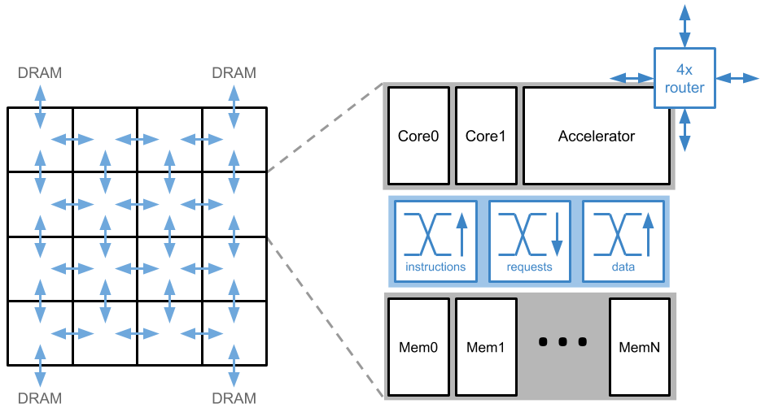
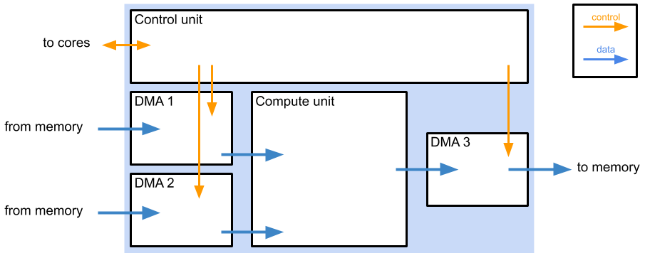

# lokisim
Simulator for the [Loki many-core architecture](https://link.springer.com/article/10.1007/s11265-014-0944-6). This branch includes the experimental Loki Accelerator Template which accelerates machine learning workloads.

## Model
Loki is a tiled, many-core processor, where the on-chip network is deeply integrated into the components. e.g. Most instruction encodings allow operands to be received directly from the network or results to be sent directly onto the network, and all memory access is performed over the network. This allows flexibility in which resources are accessible, and allows the simple cores and memory banks to cooperate [in novel ways](https://www.cl.cam.ac.uk/~db434/publications/hip3es16.pdf) to achieve more complex behaviour.

We aim to make components
* **A**ccessible: any core should be able to make use of any resource on the chip to help with its task.
* **B**ypassable: it should be possible to bypass functionality when it is not needed to reduce energy consumption (e.g. avoid checking cache tags when we already know data is present).
* **C**omposable: components should be able to work closely together, forming larger *virtual processors*.



This branch of lokisim includes the experimental Loki Accelerator Template which is designed to accelerate machine learning workloads. By default, there is one accelerator unit in each tile, and it replaces most of the Loki cores. Some cores remain to perform tasks which the accelerator is not suited to, such as unusual computations and dynamic load balancing.



The main components of the accelerator unit are:
* Control unit: responsible for stepping through the required computation and determining which data is required at each computation step. Can use different loop orders, data orders, tiling, etc.
* DMA unit x 3: responsible for moving the necessary data to/from the compute unit. May optionally have a local cache, but the default is to access the local tile’s memory banks.
* Compute unit: a pipeline of different compute stages (e.g. multiply, sum, pool, activation function), each capable of parallel computation. Local interconnection can be configured to reuse data in different ways, e.g. broadcast inputs to multiple PEs or accumulate outputs from multiple PEs.

The accelerator is used by having a core send it a block of parameters, as specified in [lat-ifc](https://github.com/ucam-comparch-loki/lat-ifc). The accelerator will notify a specified component when its computation has finished.

The structure of the simulator naturally allows it to emulate published work such as [NVDLA](http://nvdla.org/primer.html) and [DianNao](http://doi.acm.org/10.1145/2541940.2541967), and with a little effort (TODO), it can model more exotic accelerators such as [SCNN](http://doi.acm.org/10.1145/3079856.3080254) and [NullHop](https://ieeexplore.ieee.org/abstract/document/8421093).


## Native installation
### Prerequisites
Requires Ubuntu >= 19.04.

```
sudo apt install libsystemc-dev
```

### Build
```
cd build
make -j8
```

### Usage
```
lokisim [simulator options] <program> [program arguments]
```

See the [wiki](https://github.com/ucam-comparch-loki/lokisim/wiki) for further information on available parameters. Program binaries must be compiled for the Loki architecture.

## Docker
### Build
```
docker build --network=host . -t lokisim
```

### Usage
```
docker run -v </abs/path/to/program/dir>:/app lokisim [simulator options] /app/<program> [program arguments]
```